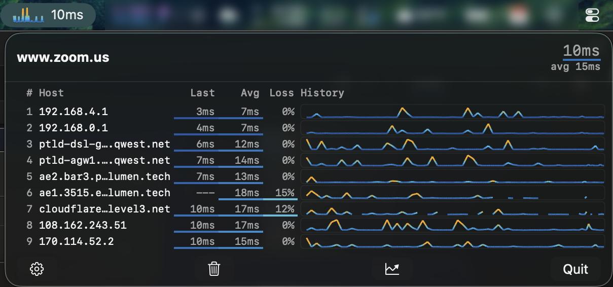
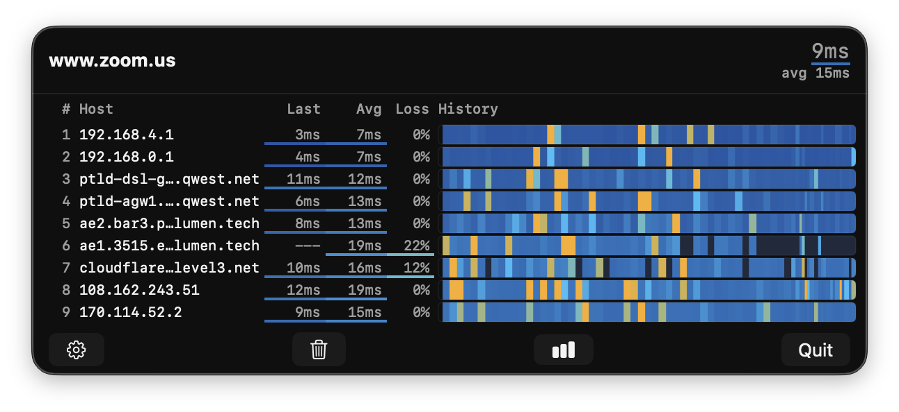

# TraceBar

A macOS menubar app that provides continuous graphical traceroute monitoring, like [mtr](https://github.com/traviscross/mtr) but native and always a click away.




## Features

- **Live traceroute** — continuous probing with per-hop latency, loss, and hostname resolution
- **Menubar sparkline** — at-a-glance latency graph right in your menubar
- **Time-normalized heatmap** — scrolling history visualization with multiple color schemes
- **Adaptive probing** — faster updates when the panel is open, slower when idle
- **Configurable** — probe intervals, history window, max hops, DNS resolution, color schemes

## Requirements

- macOS 14.6+
- Xcode 15+ (to build)

## Building

1. Open `TraceBar/TraceBar.xcodeproj` in Xcode
2. Build and run the **TraceBar** scheme

## Architecture

Single-process sandboxed app. Uses unprivileged `SOCK_DGRAM` ICMP sockets — no root privileges, no helper daemon, works inside App Sandbox.

```
TraceBar.app (SwiftUI, menubar-only, App Sandbox)
  ├── TracerouteViewModel — state management, adaptive probe scheduling
  ├── ICMPEngine — SOCK_DGRAM ICMP, TTL manipulation
  └── Views: SparklineView, TraceroutePanel, HeatmapBar, SettingsView
```

## License

[MIT](LICENSE)
